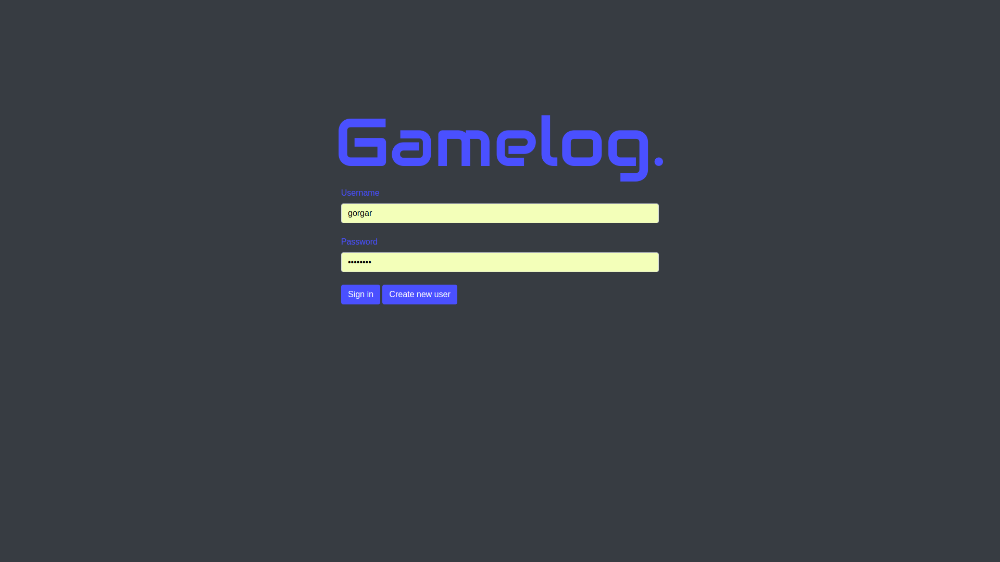
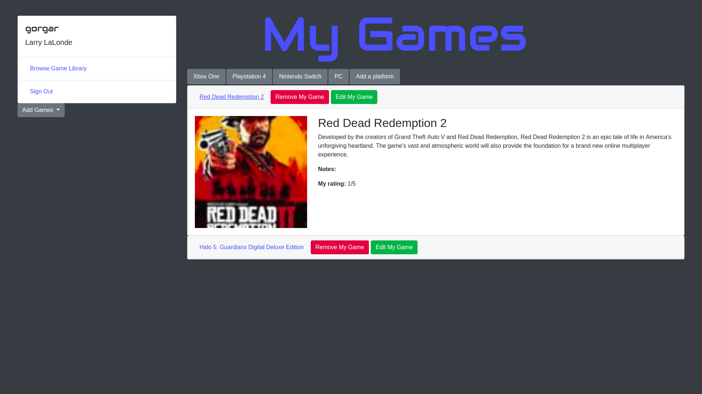
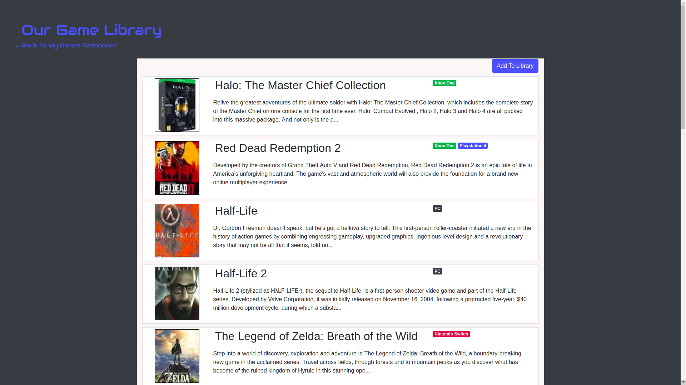
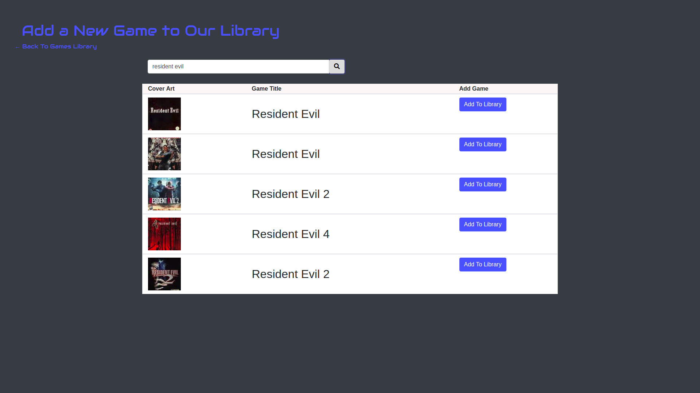

# game-log-front-end
Front end for Gamelog, a Galvanize Gamer Gallery production. 

Gamelog is a personal library tracker intended to help organize the life of the avid gamer. 

## Setup

Gamelog runs entirely in browser, and is free of charge. Access at https://galv-game-gallery.surge.sh/. No installation is required; user's information will be stored in its backend database. User needs only to create an account and sign in on the landing page.

## How-to

Upon login, user is greeted with a "My Games" page that shows the user's personal collection, including their platforms and games they've added for each. The "shelf" of games for each platform can be scrolled through, with games expanded on click to show their information, including cover and description pulled from the Internet Games Database (IGDB) API, and the user's personal notes and rating for the game. Games can be removed or edited from here as well. 

On the left column, an "Add Games" button will allow the user to add games to their platforms. "Browse Game Library" will take them to Gamelog's library, a list of games available to add to a user's shelf. This library can be expanded by the user via the "Add to Library" button, which takes them to a search that will return results from IGDB

